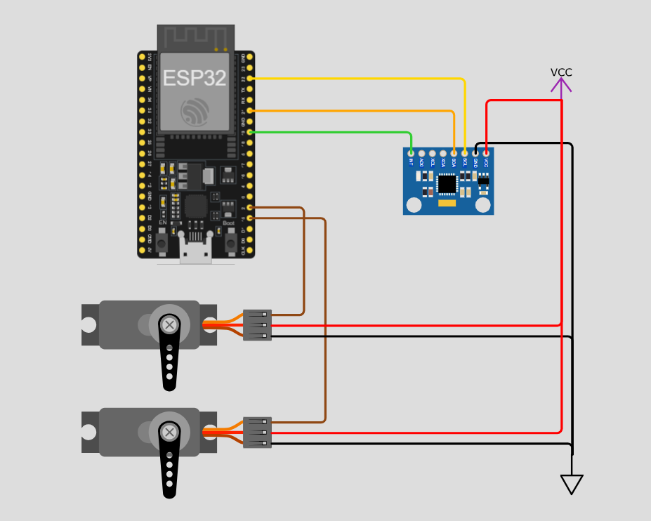

# 2-Axis Gimbal Stabilization — ESP32 + MPU6050

A real-time 2-axis gimbal stabilization system using dual PID controllers,
tuned with the Ziegler-Nichols method and monitored via a MATLAB GUI.

## Military Context
Simulates a stabilized weapon/camera mount that maintains a fixed orientation
regardless of platform movement — the core principle behind targeting pods,
CIWS systems, and drone gimbals.

## System Overview

[INSERT: block diagram showing MPU6050 → ESP32 → Servos feedback loop]

## Hardware

| Component | Details |
|---|---|
| MCU | ESP32 |
| IMU | MPU6050 (DMP mode) |
| Actuators | 2x Servo motors |
| Mount | Pan-Tilt gimbal |

**Wiring:**
- SDA → GPIO21
- SCL → GPIO22
- INT → GPIO19 ← critical for interrupt-based reading
- Pan Servo → GPIO2
- Tilt Servo → GPIO15

## Wiring Diagram

## Control Design

**PID — Ziegler-Nichols Tuning:**

| Parameter | Value |
|---|---|
| Ku (ultimate gain) | 1.6 |
| Tu (oscillation period) | 0.21s |
| Kp | 0.8 |
| Ki | 16.8 |
| Kd | 0.0105 |

[INSERT: step response plot from MATLAB showing settling time and overshoot]

## Software Architecture
